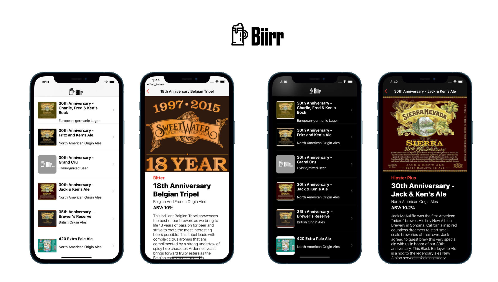

# Biirr 
App that presents a list of beers from BreweryDB's API

## Endpoint:
https://sandbox-api.brewerydb.com/v2/beers

Please get your own API key at https://www.brewerydb.com

## Features: 
- UITableView 
- UIScrollView 
- JSON decoding 

## Dependencies:
SDWebImage to read and cache images from URL.

## Tutorials:
https://medium.com/swift-productions/uitableview-custom-cells-brewerydb-d06a7996b9df

https://medium.com/swift-productions/uitableview-custom-cell-details-scrollview-30af3774f271

## Screenshots:

